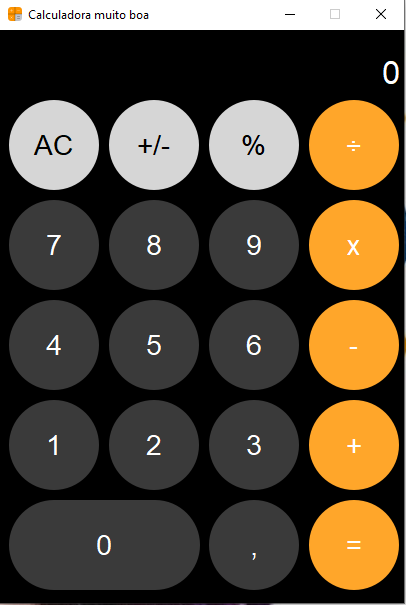

# Calculadora IPhone 

<div align="center">



</div>

> Projeto desenvolvido durante o periodo do curso Técnico em Desenvolvimento de Sistemas no Senac Sorocaba
## 💻 Pré-requisitos

Antes de começar, verifique se você atendeu aos seguintes requisitos:

- Você instalou a versão mais recente de `<Python 3.12>`
- Você tem uma máquina `<Windows / Linux>`.
- Configurado o Ambiente Virtual:
    - `python -m venv env`

- Instalação das dependências
    - `PyQt5`
    - `Auto-Py-To-Exe`

### Ajustes e melhorias

O projeto ainda está em desenvolvimento e as próximas atualizações serão voltadas nas seguintes tarefas:

- [x] Interface Gráfica
- [x] Layout do Iphone
- [x] Prédefinir o tamanho fixo da interface
- [ ] Ajustar tamanho da fonte do display
- [ ] Implementar notação científica

## 🚀 Instalando Calculadora Iphone

Para instalar a calculadora Iphone, siga estas etapas:

Windows:

```
python -m venv env
env\Scripts\Activate.ps1
python -m pip install pyqt5
python -m pip install auto-py-to-exe
```

## ☕ Usando Calculadora Iphone

Para usar a calculadora Iphone, siga estas etapas:

```
python main.py
```

Adicione comandos de execução e exemplos que você acha que os usuários acharão úteis. Fornece uma referência de opções para pontos de bônus!

## 📫 Contribuindo para a Calculadora Iphone

Para contribuir com Calculadora Iphone, siga estas etapas:

1. Bifurque este repositório.
2. Crie um branch: `git checkout -b calculadoraIPhone`.
3. Faça suas alterações e confirme-as: `git commit -m '<mensagem_commit>'`
4. Envie para o branch original: `git push origin <nome_do_projeto> / <local>`
5. Crie a solicitação de pull.

Como alternativa, consulte a documentação do GitHub em [como criar uma solicitação pull](https://help.github.com/en/github/collaborating-with-issues-and-pull-requests/creating-a-pull-request).

## 🤝 Colaboradores

Agradecemos às seguintes pessoas que contribuíram para este projeto:

<table>
  <tr>
    <td align="center">
      <a href="#" title="Samuel Henricky">
        <br>
        <sub>
          <b>Samuel Henricky</b>
        </sub>
      </a>
    </td>
    <td align="center">
      <a href="#" title="defina o titulo do link">
        <br>
        <sub>
          <b>Mark Zuckerberg</b>
        </sub>
      </a>
    </td>
    <td align="center">
      <a href="#" title="defina o titulo do link">
        <br>
        <sub>
          <b>Steve Jobs</b>
        </sub>
      </a>
    </td>
    <td align="center">
      <a href="#" title="defina o titulo do link">
        <br>
        <sub>
          <b>Nego Ney</b>
        </sub>
      </a>
    </td>
  </tr>
</table>
